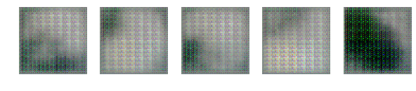
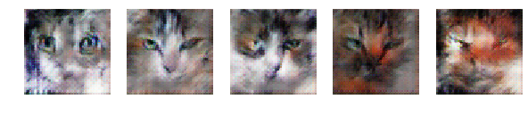
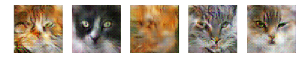

# DCGAN(Deep Convolutional Generative Adversarial Networks)
Pytorch implementation of DCGAN and trained on Cat Dataset

* Dataset - [link](https://www.kaggle.com/crawford/cat-dataset)

## Training Visualisation
Epoch 1:

Epoch 50:

Epoch 100:

